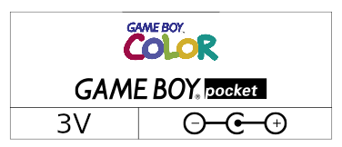

## Bench Power Supplies Labels for Retro Systems

Those are simple labels to attach to home-made power cables, mostly for
retro consoles and computers that aren't powered by mains cables.

I usually go to my electronics store with the item that I want to power,
and come back out with a barrel plug to solder, and some screw-on banana
plugs. The screw-on banana plugs go in my bench power supply, the connector
to the piece of equipment I want to power, with the polarity and voltage
easy to double-check on the label.

One cable per connector and voltage combination. This avoids problems where
you might think a voltage is for one piece of equipment on the label, but
it's actually for another.

- [PDF #1](bench-power-supply-cables.pdf):
  - Nintendo Game Boy Color, Game Boy Pocket
  - Sega Genesis/Mega Drive II
  - Sega-CD/Mega-CD II
  - Sony PS One
  - Sony PSP
  - Atari 2600
- [PDF #2](bench-power-supply-cables-2.pdf):
  - Sega Genesis/Mega Drive I
  - ATGames Firecore Genesis/Mega Drive
  - Sega Master System I
  - Sega SC-3000
  - Sega Game Gear
  - Amstrad CPC 464

The label was created using Inkscape, the logos from various places around the
Internet, with fair use as the reason for inclusion.
